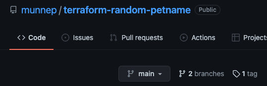
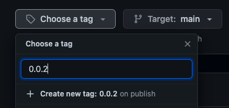
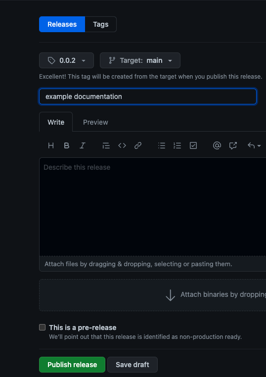
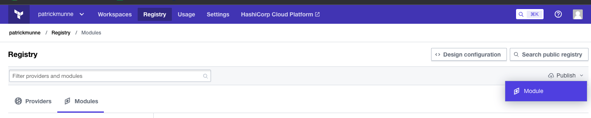
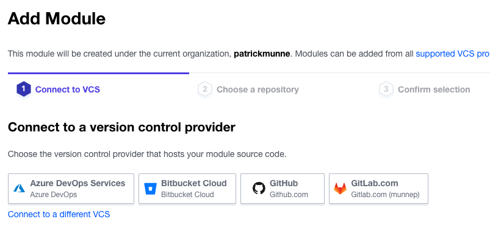
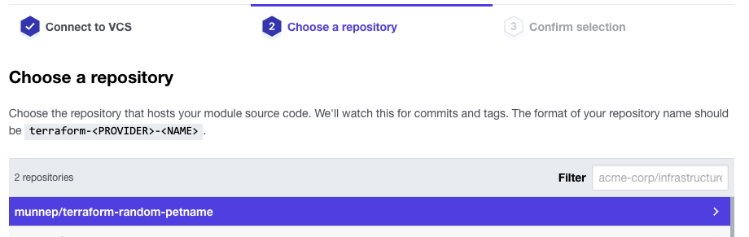
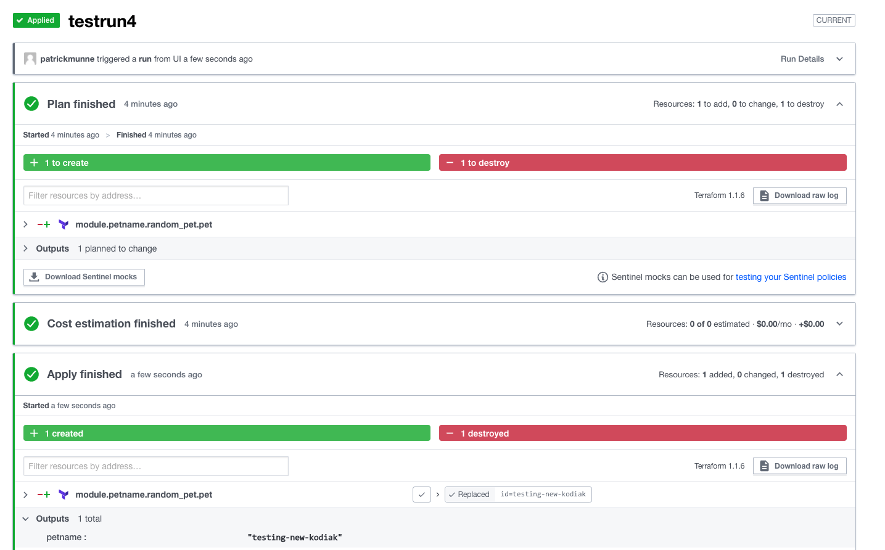

# Module to use

Generates a private name for you pet

# How to

## Repository
The repository name of your module to use in a private registry should have the format of
```
terraform-<PROVIDER>-<NAME>
```
In this case it is made as terraform-random-petname


## Tags
You should make a tag with a version number
- Go to your repository and click tags  
  
- Click on releases 
- draft a new release  
  
- Choose a tag 
- tag name should be format ```x.y.z```  
  
- select Publish release  
  

## Import it in the private registry
- Log into your terraform Cloud
- Click on registry
- Click on Publish Module  
    
- Select the location where your repository exists  
    
- select your module  
  
- select publish module  
  
- It should now be available to be used  
```
module "petname" {
  source  = "app.terraform.io/patrickmunne/petname/random"
  version = "0.0.2"
}
```

## Use the private module

Create a repository that has the following files

https://github.com/munnep/tfc_use_private_module

You can run the code from Terraform Cloud
  